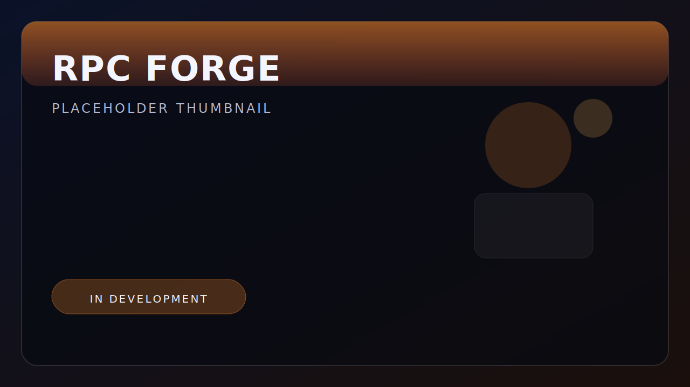

## LandSnap version 1.0.0 released

LandSnap v1.0.0 is now live.

This release marks the first stable version of the toolset and locks in the core placement workflow for day-to-day production use.

Watch the overview video: [YouTube](https://www.youtube.com/watch?v=3kf6S1Dcyp4)  
Read full docs: [LandSnap documentation](../../Studio/Landsnap.html#documentation)

## What is included

- Stable base feature set for terrain-aware placement.
- Polished defaults for faster out-of-the-box setup.
- Documentation and naming cleanup from the beta cycle.

## What comes next

Next updates will focus on quality-of-life improvements, edge-case handling, and targeted iteration from creator feedback.
